# Sri Jayant

Enterprise Architect — **SAP BTP**, **AI Core**, and **Agentic AI** for regulated MedTech.

My agent stack as a game — [play the interactive version](https://srijayant.github.io/srijayant/agent-world/) ([source](agent-world/index.html)): agents walk the pipeline, you approve releases at the HITL gate.

13+ years across SAP ABAP → BTP full-stack (CAP / RAP / Fiori). Currently lead architect on a **100+ application** BTP estate at Boston Scientific (FDA-validated landscape). M.Tech AI/ML (BITS Pilani) · SAP Certified BTP Solution Architect.

## What I build
- Agentic AI on SAP AI Core (multi-agent orchestration, human-in-the-loop governance)
- BTP platforms: CAP (Node.js), RAP/ABAP Cloud, CDS, Fiori, XSUAA
- AI-enabled ERP / supply chain / quality automation in validated environments

## Featured work
| Project | Focus |
| --- | --- |
| [BTP ALM Health Agent](https://github.com/srijayant/btp-alm-health-agent) | Governed agentic risk commentary for BTP estates |
| [CrewAI Agentic SDLC](https://github.com/srijayant/crewai-btp-sdlc) | Multi-agent SDLC on BTP/AI Core with HITL gates |
| [HANA Cloud RAG + AI Core](https://github.com/srijayant/hana-cloud-rag-aicore) | Enterprise RAG with HANA vectors + AI Core |
| [XSUAA Multi-Tenant Kit](https://github.com/srijayant/btp-xsuaa-multitenant-kit) | CAP multi-tenant security reference |
| [FDA AI Validation Playbook](https://github.com/srijayant/fda-ai-validation-playbook) | Validating agentic AI in MedTech / FDA landscapes |
| [Globe Localization Engine](https://github.com/srijayant/BSCI-BTP-POC) | CAP/CDS compliance for medical-device localization |
| [abap-harvester](https://github.com/srijayant/abap-harvester) | SAP ABAP knowledge-base tooling |
| [pralay](https://github.com/srijayant/pralay) | Side project — 3D WebGL open world |

> Concept repos are public reference architectures. Production enterprise systems stay private / sanitized.

## Stack
`SAP BTP` · `AI Core` · `CAP` · `RAP` · `CDS` · `Fiori/UI5` · `ABAP on HANA` · `CrewAI` · `Python` · `Node.js` · `HANA Cloud`

## Contact
Pune, India · [GitHub](https://github.com/srijayant) · srijayantsingh@gmail.com
